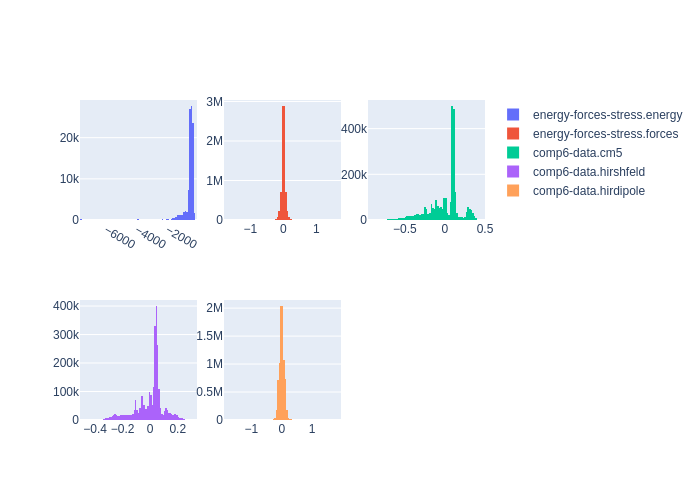

# Summary
|Chemical systems|Element ratios|# of properties|# of configurations|# of atoms|
|---|---|---|---|---|
|HO, CNO, CHO, CH, CHN, CHNO|C (34.1%), H (51.8%), N (7.4%), O (6.6%)|202704|101352|2608858|

# Name

COMP6

# Authors

Justin S. Smith

Ben Nebgen

Nicholas Lubbers

Olexandr Isayev

Adrian E. Roitberg

# Links

https://aip.scitation.org/doi/full/10.1063/1.5023802

https://github.com/isayev/COMP6

# Description

This repository contains the COMP6 benchmark for evaluating the extensibility of machine-learning based molecular potentials.

# Storage format

|Elements|File|Format|Name field|
|---|---|---|---|
| C, H, N, O | 8226289313606014556 | mongo | _name |

# Properties

|Property|KIM field|ASE field|Units
|---|---|---|---|
| [energy-forces-stress](/home/jvita/scripts/colabfit-tools/colabfit/examples/COMP6/energy-forces-stress.edn) | energy | energy | kcal/mol
| [energy-forces-stress](/home/jvita/scripts/colabfit-tools/colabfit/examples/COMP6/energy-forces-stress.edn) | forces | forces | kcal/mol/Ang
| [comp6-data](/home/jvita/scripts/colabfit-tools/colabfit/examples/COMP6/comp6-data.edn) | cm5 | cm5 | elementary_charge
| [comp6-data](/home/jvita/scripts/colabfit-tools/colabfit/examples/COMP6/comp6-data.edn) | hirshfeld | hirshfeld | elementary_charge
| [comp6-data](/home/jvita/scripts/colabfit-tools/colabfit/examples/COMP6/comp6-data.edn) | hirdipole | hirdipole | elementary_charge*Ang

# Property settings

|ID|Method|Description|Labels|Files|
|---|---|---|---|---|
| -9137475941196217644 | Gaussian09 | COMP6 property settings calculation | 6-31G(d), DFT, wb97x |  |

# Configuration sets

|ID|Description|# of structures| # of atoms|
|---|---|---|---|
| -5955491494849132288 | Forces from the ANI-1x potential are applied to run 1 ns of vacuum molecular dynamics with a 0.25 fs time step at 300 K using the Langevin thermostat on 14 well-known drug molecules and two small proteins. System sizes range from 20 to 312 atoms. A random subsample of 128 frames from each 1 ns trajectory is selected, and reference DFT single point calculations are performed to obtain QM energies and forces. | 1791 | 134603 |
| -6197403345662699474 | This benchmark is developed through a subsampling of the DrugBank database of real drug molecules. 837 SMILES strings containing C, N, and O are randomly selected. Like the GDB7to9 benchmark, the molecules are embedded in 3D space, structurally optimized, and normal modes are computed. DNMS is utilized to generate random non-equilibrium conformations. | 13379 | 594423 |
| 2049126764119561022 | The GDB-11 subsets containing 7 to 9 heavy atoms (C, N, and O) are subsampled and randomly embedded in 3D space using RDKit [www.rdkit.org]. A total of 1500 molecule SMILES [opensmiles.org] strings are selected: 500 per 7, 8, and 9 heavy-atom sets. The resulting structures are optimized with tight convergence criteria, and normal modes/force constants are computed using the reference DFT model. Finally, diverse normal mode sampling (DNMS) is carried out to generate non-equilibrium conformations. | 36000 | 612360 |
| -6190206024692860848 | GDB10to13 benchmark. Subsamples of 500 SMILES strings each from the 10 and 11 heavy-atom subsets of GDB-11 and 1000 SMILES strings from the 12 and 13 heavy-atom subsets of the GDB-13 database are randomly selected. DNMS is utilized to generate random non-equilibrium conformations. | 47670 | 1152816 |
| 4224165675534650211 | Tripeptide benchmark. 248 random tripeptides containing H, C, N, and O are generated using FASTA strings and randomly embedded in 3D space using RDKit. As with GDB7to9, the molecules are optimized, and normal modes are computed. DNMS is utilized to generate random non-equilibrium conformations. | 1984 | 104144 |
| -7347487409436491056 | S66x8 benchmark. This dataset is built from the original S66x850 benchmark for comparing accuracy between different methods in describing noncovalent interactions common in biological molecules. S66x8 is developed from 66 dimeric systems involving hydrogen bonding, pi-pi stacking, London interactions, and mixed influence interactions. While the keen reader might question the use of this benchmark without dispersion corrections, since dispersion corrections such as the D362 correction by Grimme et al. are a posteriori additions to the produced energy, then a comparison without the correction is equivalent to a comparison with the same dispersion corrections applied to both models. | 528 | 10512 |

# Configuration labels

|Labels|Counts|
|---|---|

# Figures

