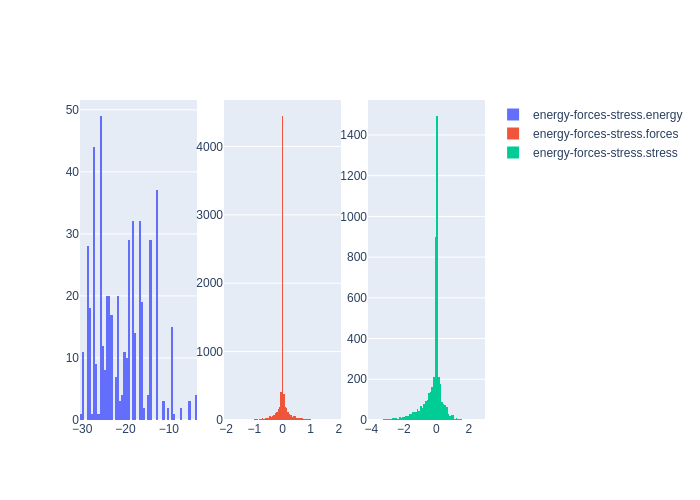

# Summary
|Chemical systems|Element ratios|# of properties|# of configurations|# of atoms|
|---|---|---|---|---|
|Pd, CuPd, Cu|Cu (54.0%), Pd (46.0%)|522|522|2450|

# Name

CuPd_CMS2019

# Authors

K. Gubaev

E. V. Podryabinkin

G. L. W. Hart

A. V. Shapeev

# Links

https://www.sciencedirect.com/science/article/pii/S0927025618306372?via%3Dihub

https://gitlab.com/kgubaev/accelerating-high-throughput-searches-for-new-alloys-with-active-learning-data

# Description

This dataset was generated using the following active learning scheme: 1) candidate structures relaxed by a partially-trained MTP model, 2) structures for which the MTP had to perform extrapolation are passed to DFT to be re-computed, 3) the MTP is retrained included the structures that were re-computed with DFT, 4) steps 1-3 are repeated until the MTP does not extrapolate on any of the original candidate structures. The original candidate structures for this dataset included 40,000 unrelaxed configurations with BCC, FCC, and HCP lattices.

# Storage format

|Elements|File|Format|Name field|
|---|---|---|---|
| Cu, Pd | 4895986077146164442 | mongo | _name |

# Properties

|Property|KIM field|ASE field|Units
|---|---|---|---|
| [energy-forces-stress](/home/jvita/scripts/colabfit-tools/colabfit/examples/CuPd_CMS2019/energy-forces-stress.edn) | energy | energy | eV
| [energy-forces-stress](/home/jvita/scripts/colabfit-tools/colabfit/examples/CuPd_CMS2019/energy-forces-stress.edn) | forces | forces | eV/Ang
| [energy-forces-stress](/home/jvita/scripts/colabfit-tools/colabfit/examples/CuPd_CMS2019/energy-forces-stress.edn) | stress | stress | GPa

# Property settings

|ID|Method|Description|Labels|Files|
|---|---|---|---|---|
| 2231808486057270801 | VASP | energies/forces/stresses |  |  |

# Configuration sets

|ID|Description|# of structures| # of atoms|
|---|---|---|---|
| -4661574783975693883 | Configurations generated using active learning by iteratively fitting a MTP model, identifying configurations that required the MTP to extrapolate, re-computing the energies/forces/structures of those configurations with DFT, then retraining the MTP model. | 522 | 2450 |

# Configuration labels

|Labels|Counts|
|---|---|
| active_learning | 522 |

# Figures

