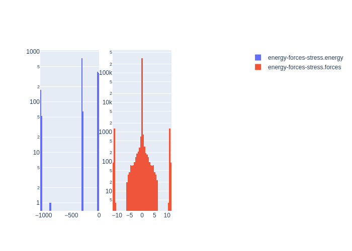

# Summary
|Chemical systems|Element ratios|# of properties|# of configurations|# of atoms|
|---|---|---|---|---|
|InP, In|In (49.9%), P (50.1%)|1802|1802|106761|

# Name

InP_JPCA2020

# Authors

M. A. Cusentino

M. A. Wood

A. P. Thompson

# Links

https://pubs.acs.org/doi/10.1021/acs.jpca.0c02450

https://github.com/FitSNAP/FitSNAP/tree/master/examples/InP_JPCA2020

# Description

This data set was used to generate a multi-element linear SNAP potential for InP as published in Cusentino, M.A. et. al, J. Chem. Phys. (2020). Intended to produce an interatomic potential for indium phosphide capable of capturing high-energy defects that result from radiation damage cascades.

# Storage format

|Elements|File|Format|Name field|
|---|---|---|---|
| In, P | 3334980427067503474 | mongo | _name |

# Properties

|Property|KIM field|ASE field|Units
|---|---|---|---|
| [energy-forces-stress](/home/jvita/scripts/colabfit-tools/colabfit/examples/InP_JPCA2020/energy-forces-stress.edn) | energy | energy | eV
| [energy-forces-stress](/home/jvita/scripts/colabfit-tools/colabfit/examples/InP_JPCA2020/energy-forces-stress.edn) | forces | forces | eV/Ang

# Property settings

|ID|Method|Description|Labels|Files|
|---|---|---|---|---|
| 2231808486057270801 | VASP | energies/forces/stresses | PBE, LDA |  |

# Configuration sets

|ID|Description|# of structures| # of atoms|
|---|---|---|---|
| 8338359635591740235 | Curated configurations for producing an interatomic potential for indium phosphide capable of capturing high-energy defects that result from radiation damage cascades | 1802 | 106761 |
| 7003463652066260836 | Ground state configuration for bulk zinc blende | 1 | 8 |
| -3198952389510455189 | Bulk zinc blende with uniform expansion and compression | 268 | 2080 |
| 4702382284259800770 | Bulk zincblende with random cell shape modifications | 346 | 2768 |
| -4486615060992780716 | Uniaxially strained bulk zinc blende | 163 | 1304 |
| -5766861277022779214 | Antisite defects in InP | 53 | 11448 |
| 3197562081088253374 | Diantisite defects | 10 | 2160 |
| 1078988179005368838 | Interstitial defects in InP | 136 | 29512 |
| -8525809267628901117 | Vacancy defects in InP | 10 | 2150 |
| 6663209769768423460 | Divacancy defects in InP | 19 | 4066 |
| 5059258973862977394 | No description | 211 | 13504 |
| -3319727754231842516 | No description | 458 | 29770 |
| -8580774296682708065 | No description | 63 | 3969 |
| 507070363522612685 | No description | 65 | 4030 |

# Configuration labels

|Labels|Counts|
|---|---|
| zincblende | 777 |
| strain | 509 |
| eos | 268 |
| vacancy | 29 |
| interstitial | 136 |
| antisite | 53 |
| diantisite | 10 |

# Figures

