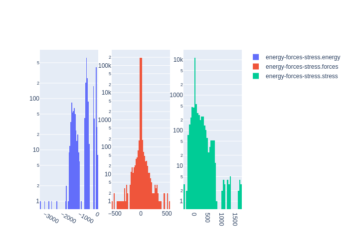

# Summary
|Chemical systems|Element ratios|# of properties|# of configurations|# of atoms|
|---|---|---|---|---|
|MoW, MoNb, MoTaW, VW, MoNbVW, MoNbTa, NbW, MoNbV, TaW, NbTa, MoTaV, MoNbTaVW, MoNbW, MoTaVW, Ta, MoTa, NbTaVW, Mo, MoVW, NbV, NbTaV, MoNbTaV, V, TaV, Nb, MoV, W, NbTaW, MoNbTaW, NbVW, TaVW|Nb (20.0%), V (19.8%), Mo (20.0%), Ta (20.1%), W (20.0%)|2329|2329|127913|

# Name

MoNbTaVW_PRB2021

# Authors

J. Byggmästar

K. Nordlund

F. Djurabekova

# Links

https://journals.aps.org/prb/abstract/10.1103/PhysRevB.104.104101

https://doi.org/10.23729/1b845398-5291-4447-b417-1345acdd2eae

# Description

This dataset was originally designed to fit a GAP model for the Mo-Nb-Ta-V-W quinary system that was used to study segregation and defects in the body-centered-cubic refractory high-entropy alloy MoNbTaVW.

# Storage format

|Elements|File|Format|Name field|
|---|---|---|---|
| Nb, V, Mo, Ta, W | -3298842863513059629 | mongo | _name |

# Properties

|Property|KIM field|ASE field|Units
|---|---|---|---|
| [energy-forces-stress](/home/jvita/scripts/colabfit-tools/colabfit/examples/MoNbTaVW_PRB2021/energy-forces-stress.edn) | energy | energy | eV
| [energy-forces-stress](/home/jvita/scripts/colabfit-tools/colabfit/examples/MoNbTaVW_PRB2021/energy-forces-stress.edn) | forces | forces | eV/Ang
| [energy-forces-stress](/home/jvita/scripts/colabfit-tools/colabfit/examples/MoNbTaVW_PRB2021/energy-forces-stress.edn) | stress | stress | GPa

# Property settings

|ID|Method|Description|Labels|Files|
|---|---|---|---|---|
| 2231808486057270801 | VASP | energies/forces/stresses | GGA, PBE, LDA |  |

# Configuration sets

|ID|Description|# of structures| # of atoms|
|---|---|---|---|
| -96433667584554982 | A variety of Mo-Nb-Ta-V-W structures | 2329 | 127913 |
| -1714506147018817578 | Ternary, quaternary, and quinary BCC alloys. 3 linearly spaced compositions were sampled, each with 3 different lattice constants. Atoms are randomly ordered and shifted slightly from their lattice positions. | 619 | 33426 |
| 732321018987687621 | Liquid configurations | 180 | 23040 |
| -4300493502537540342 | Configurations with single self-interstitial defects | 25 | 3025 |
| -2044096285869240211 | Single-vacancy configurations | 25 | 1325 |
| 7358321943762181167 | BCC configurations with random strains up to +/- 30% to help train the far-from-equilibrium elastic response | 250 | 500 |
| -3344044027022087025 | Binary BCC alloys sampling 10 different concentrations from A_0.05B_0.95 to A_0.95B_0.05 and 3 different lattice constants for every composition. Atoms are randomly ordered and shifted slightly from their lattice positions. | 300 | 16200 |
| 1464902600086444132 | Configurations with two self-interstitial defects | 25 | 3700 |
| 8115301121541679223 | Divacancy configurations | 25 | 2950 |
| -6924708299054558101 | Dimers to fit to the full dissociation curve starting from 1.1 angstrom | 190 | 380 |
| 8126755762822801844 | Configurations representing the full gamma surface | 50 | 600 |
| -1346747849114800150 | 1-5 interstitial atoms randomly inserted into HEA lattices and relaxed with a partially-trained tabGAP model | 70 | 9175 |
| -8750306496857055134 | Randomly placed unrelaxed interstitial atom in HEAs to fit repulsion inside crystals, making sure that the closest interatomic distance is not too short for DFT to be unreliable (> 1.35 Ang) | 100 | 5500 |
| -6062140622993292689 | Bulk equiatomic quinary HEAs. Atoms are randomly ordered and shifted slightly from their lattice positions. The lattice constant is randomised in the range 3-3.4 Angstrom | 100 | 5400 |
| 4874195516099772278 | Disordered HEA surfaces, including some of the damaged/molten surface configurations from an existing pure W dataset that were turned into HEAs | 24 | 3240 |
| -2449271312294460610 | 1-5 vacancies randomly inserted into HEA lattices, then relaxed with a partially-trained tabGAP model | 45 | 5621 |
| 2150888055056459518 | Isolated W atom | 5 | 5 |
| 3484587417837230257 | Liquid equiatomic binary, ternary, quaternary, and quinary alloys at different densities | 75 | 9600 |
| 3507299460800560087 | Liquid HEA configurations | 55 | 7040 |
| -3631270755204612451 | Equiatomic quinary alloys generated via active learning by running MCMD with a partially-trained tabGAP model. | 6 | 768 |
| 1374645150773328941 | Ordered binary, ternary, and quaternary alloys (always as a BCC lattice, but with different crystal symmetries of the elemental sublattices) | 165 | 2640 |
| 6898646126369204509 | MD snapshots taken at 1000K for three different volumes | 25 | 1350 |
| 8082673511841540864 | BCC crystals with random interstitial atom defects to capture short-range many-body dynamics | 150 | 8203 |
| 7337808603687838136 | Damaged and half-molten (110) and (100) surfaces | 25 | 3440 |
| 9183760832266705497 | Trivacancy configurations | 25 | 2925 |

# Configuration labels

|Labels|Counts|
|---|---|
| bcc | 865 |
| hea | 394 |
| interstitial | 270 |
| warning | 340 |
| large_forces | 340 |
| repulsive | 340 |
| dimer | 190 |
| strain | 250 |
| vacancy | 120 |
| divacancy | 50 |
| trivacancy | 25 |
| gamma_surface | 50 |
| surface | 99 |
| liquid | 205 |
| aimd | 31 |
| isolated_atom | 5 |

# Figures

