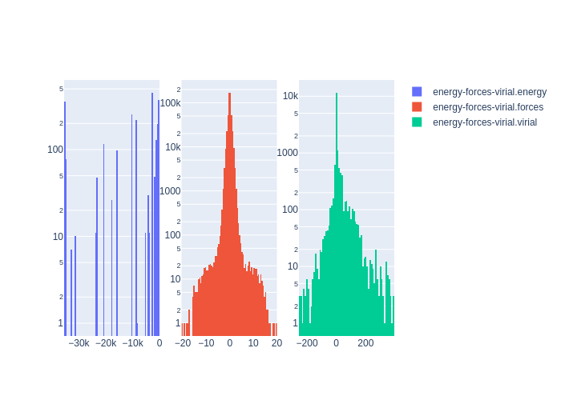

# Summary
|Chemical systems|Element ratios|# of properties|# of configurations|# of atoms|
|---|---|---|---|---|
|Si, Mo, NbTa, MoNbW, NbTaV, NbVW, TaVW, Nb, MoNbVW, MoTaW, MoNbV, MoW, TaW, MoV, InP, W, MoTaV, NbTaW, MoNbTaV, TaV, MoNb, MoNbTaW, V, MoVW, VW, NbV, NbTaVW, MoTaVW, NbW, MoNbTa, MoTa, MoNbTaVW, Ta|Si (63.0%), Mo (12.8%), Nb (12.8%), Ta (3.1%), V (3.1%), W (3.1%), In (1.0%), P (1.0%)|4950|6002|271488|

# Name

Si_PRX_GAP

# Authors

Albert P. Bartók

James Kermode

Noam Bernstein

Gábor Csányi

# Links

https://journals.aps.org/prx/abstract/10.1103/PhysRevX.8.041048

https://www.repository.cam.ac.uk/handle/1810/317974

# Description

The original DFT training data for the general-purpose silicon interatomic potential described in the associated publication. The kinds of configuration that we include are chosen using intuition and past experience to guide what needs to be included to obtain good coverage pertaining to a range of properties.

# Storage format

|Elements|File|Format|Name field|
|---|---|---|---|
| Si, Mo, Nb, Ta, V, W, In, P | 4630301895257194288 | mongo | _name |

# Properties

|Property|KIM field|ASE field|Units
|---|---|---|---|
| [si-prx-gap-data](/home/jvita/scripts/colabfit-tools/colabfit/examples/Si_PRX_GAP/si-prx-gap-data.edn) | mix-history-length | mix-history-length | None
| [si-prx-gap-data](/home/jvita/scripts/colabfit-tools/colabfit/examples/Si_PRX_GAP/si-prx-gap-data.edn) | castep-file-name | castep-file-name | None
| [si-prx-gap-data](/home/jvita/scripts/colabfit-tools/colabfit/examples/Si_PRX_GAP/si-prx-gap-data.edn) | popn-calculate | popn-calculate | None
| [si-prx-gap-data](/home/jvita/scripts/colabfit-tools/colabfit/examples/Si_PRX_GAP/si-prx-gap-data.edn) | positions | positions | Ang
| [si-prx-gap-data](/home/jvita/scripts/colabfit-tools/colabfit/examples/Si_PRX_GAP/si-prx-gap-data.edn) | task | task | None
| [si-prx-gap-data](/home/jvita/scripts/colabfit-tools/colabfit/examples/Si_PRX_GAP/si-prx-gap-data.edn) | castep-run-time | castep-run-time | s
| [si-prx-gap-data](/home/jvita/scripts/colabfit-tools/colabfit/examples/Si_PRX_GAP/si-prx-gap-data.edn) | calculate-stress | calculate-stress | None
| [si-prx-gap-data](/home/jvita/scripts/colabfit-tools/colabfit/examples/Si_PRX_GAP/si-prx-gap-data.edn) | frac-pos | frac-pos | None
| [si-prx-gap-data](/home/jvita/scripts/colabfit-tools/colabfit/examples/Si_PRX_GAP/si-prx-gap-data.edn) | cutoff-factor | cutoff-factor | None
| [si-prx-gap-data](/home/jvita/scripts/colabfit-tools/colabfit/examples/Si_PRX_GAP/si-prx-gap-data.edn) | elec-energy-tol | elec-energy-tol | None
| [si-prx-gap-data](/home/jvita/scripts/colabfit-tools/colabfit/examples/Si_PRX_GAP/si-prx-gap-data.edn) | mixing-scheme | mixing-scheme | None
| [si-prx-gap-data](/home/jvita/scripts/colabfit-tools/colabfit/examples/Si_PRX_GAP/si-prx-gap-data.edn) | in-file | in-file | None
| [si-prx-gap-data](/home/jvita/scripts/colabfit-tools/colabfit/examples/Si_PRX_GAP/si-prx-gap-data.edn) | kpoints-mp-grid | kpoints-mp-grid | None
| [si-prx-gap-data](/home/jvita/scripts/colabfit-tools/colabfit/examples/Si_PRX_GAP/si-prx-gap-data.edn) | cutoff | cutoff | Ang
| [si-prx-gap-data](/home/jvita/scripts/colabfit-tools/colabfit/examples/Si_PRX_GAP/si-prx-gap-data.edn) | xc-functional | xc-functional | None
| [si-prx-gap-data](/home/jvita/scripts/colabfit-tools/colabfit/examples/Si_PRX_GAP/si-prx-gap-data.edn) | smearing-width | smearing-width | eV
| [si-prx-gap-data](/home/jvita/scripts/colabfit-tools/colabfit/examples/Si_PRX_GAP/si-prx-gap-data.edn) | fix-occupancy | fix-occupancy | None
| [si-prx-gap-data](/home/jvita/scripts/colabfit-tools/colabfit/examples/Si_PRX_GAP/si-prx-gap-data.edn) | spin-polarized | spin-polarized | None
| [si-prx-gap-data](/home/jvita/scripts/colabfit-tools/colabfit/examples/Si_PRX_GAP/si-prx-gap-data.edn) | nextra-bands | nextra-bands | None
| [si-prx-gap-data](/home/jvita/scripts/colabfit-tools/colabfit/examples/Si_PRX_GAP/si-prx-gap-data.edn) | fine-grid-scale | fine-grid-scale | None
| [si-prx-gap-data](/home/jvita/scripts/colabfit-tools/colabfit/examples/Si_PRX_GAP/si-prx-gap-data.edn) | finite-basis-corr | finite-basis-corr | None
| [si-prx-gap-data](/home/jvita/scripts/colabfit-tools/colabfit/examples/Si_PRX_GAP/si-prx-gap-data.edn) | opt-strategy-bias | opt-strategy-bias | None
| [si-prx-gap-data](/home/jvita/scripts/colabfit-tools/colabfit/examples/Si_PRX_GAP/si-prx-gap-data.edn) | num-dump-cycles | num-dump-cycles | None
| [si-prx-gap-data](/home/jvita/scripts/colabfit-tools/colabfit/examples/Si_PRX_GAP/si-prx-gap-data.edn) | numbers | numbers | None
| [si-prx-gap-data](/home/jvita/scripts/colabfit-tools/colabfit/examples/Si_PRX_GAP/si-prx-gap-data.edn) | max-scf-cycles | max-scf-cycles | None
| [si-prx-gap-data](/home/jvita/scripts/colabfit-tools/colabfit/examples/Si_PRX_GAP/si-prx-gap-data.edn) | cut-off-energy | cut-off-energy | eV
| [si-prx-gap-data](/home/jvita/scripts/colabfit-tools/colabfit/examples/Si_PRX_GAP/si-prx-gap-data.edn) | nneightol | nneightol | None
| [energy-forces-virial](/home/jvita/scripts/colabfit-tools/colabfit/examples/Si_PRX_GAP/energy-forces-virial.edn) | energy | energy | eV
| [energy-forces-virial](/home/jvita/scripts/colabfit-tools/colabfit/examples/Si_PRX_GAP/energy-forces-virial.edn) | forces | forces | eV/Ang
| [energy-forces-virial](/home/jvita/scripts/colabfit-tools/colabfit/examples/Si_PRX_GAP/energy-forces-virial.edn) | virial | virial | GPa

# Property settings

|ID|Method|Description|Labels|Files|
|---|---|---|---|---|
| 5142750589493701423 | CASTEP | DFT calculations using the CASTEP software | Monkhorst-Pack |  |

# Configuration sets

|ID|Description|# of structures| # of atoms|
|---|---|---|---|
| -4389668347054180725 | Reference atom | 6 | 6 |
| -5824635267897399833 | Beta-tin | 445 | 16620 |
| -7567310748584284607 | Diamond | 738 | 17304 |
| 4794220095256199381 | Simple hexagonal | 889 | 24693 |
| 8362213476184006357 | Hexagonal diamond | 49 | 196 |
| -8216362009202679745 | Body-centered-cubic | 1293 | 2586 |
| 6673358683248921842 | BC8 | 49 | 392 |
| -5950215278995046353 | Face-centered-cubic | 249 | 396 |
| -8489790585080082651 | Hexagonal-close-packed | 249 | 498 |
| 6080521885493482596 | ST12 | 49 | 588 |
| 8173775753452441507 | Liquid | 389 | 45904 |
| 1471979014546678543 | Amorphous | 159 | 29632 |
| 871335000787661527 | Diamond surface (001) | 29 | 4176 |
| -6670003141202636551 | Diamond surface (110) | 116 | 3888 |
| 8364345865449938798 | Diamond surface (111) | 177 | 10312 |
| 8457649850134281820 | Pandey reconstruction of diamond (111) surface | 50 | 4800 |
| 4042456630214913743 | Dimer-adatom-stacking-fault (DAS) reconstruction | 1 | 52 |
| 7866931783939942556 | Configurations with adatom on (111) surface | 10 | 1460 |
| -5432375111060566579 | Small (110) crack tip | 7 | 1400 |
| -5291766463766376422 | Small (111) crack tip | 10 | 1920 |
| 7718721616712032786 | Decohesion of diamond-structure Si along various directions | 33 | 792 |
| 784355495219124503 | Diamond divacancy configurations | 78 | 16692 |
| -6509210313985655225 | Diamond interstitial configurations | 112 | 24304 |
| -2352535405548580378 | Si screw dislocation core | 19 | 2736 |
| -5443040855790808964 | sp bonded configurations | 182 | 3338 |
| -4391669674975895298 | sp2 bonded configurations | 51 | 408 |
| -5383159807320331255 | Diamond vacancy configurations | 792 | 78543 |

# Configuration labels

|Labels|Counts|
|---|---|
| diamond | 1675 |
| surface | 395 |
| 110 | 123 |
| hea | 155 |
| bcc | 1613 |
| interstitial | 432 |
| warning | 320 |
| large_forces | 320 |
| repulsive | 320 |
| sh | 889 |
| zincblende | 346 |
| strain | 1990 |
| vacancy | 796 |
| sp | 182 |
| 111 | 197 |
| crac | 10 |
| sp2 | 51 |
| amorphous | 159 |
| fcc | 249 |
| divacancy | 156 |
| trivacancy | 43 |
| a5 | 445 |
| bc8 | 49 |
| sonsdaleite | 49 |
| liquid | 389 |
| hcp | 249 |
| st12 | 49 |
| 001 | 29 |
| decohesion | 33 |
| adatom | 10 |
| screw | 19 |
| dislocation | 19 |
| crack | 7 |
| das | 1 |
| isolated_atom | 6 |

# Figures

