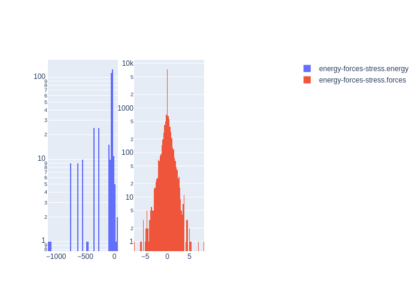

# Summary
|Chemical systems|Element ratios|# of properties|# of configurations|# of atoms|
|---|---|---|---|---|
|Ta|Ta (100.0%)|363|363|4224|

# Name

Ta_Linear_JCP2015

# Authors

A. P. Thompson

L. P. Swiler

C. R. Trott

S. M. Foiles

G. J. Tucker

# Links

https://www.sciencedirect.com/science/article/pii/S0021999114008353

https://github.com/FitSNAP/FitSNAP/tree/master/examples/Ta_Linear_JCP2014

# Description

This data set was originally used to generate a linear SNAP potential for solid and liquid tantalum as published in Thompson, A.P. et. al, J. Comp. Phys. 285 (2015) 316-330.

# Storage format

|Elements|File|Format|Name field|
|---|---|---|---|
| Ta | -1269828427399413654 | mongo | _name |

# Properties

|Property|KIM field|ASE field|Units
|---|---|---|---|
| [energy-forces-stress](/home/jvita/scripts/colabfit-tools/colabfit/examples/Ta_Linear_JCP2015/energy-forces-stress.edn) | energy | energy | eV
| [energy-forces-stress](/home/jvita/scripts/colabfit-tools/colabfit/examples/Ta_Linear_JCP2015/energy-forces-stress.edn) | forces | forces | eV/Ang

# Property settings

|ID|Method|Description|Labels|Files|
|---|---|---|---|---|
| 2231808486057270801 | VASP | energies/forces/stresses | LDA, GGA, PBE |  |

# Configuration sets

|ID|Description|# of structures| # of atoms|
|---|---|---|---|
| 4886403580396452339 | Solid and liquid tantalum | 363 | 4224 |
| -6125757131532184621 | A15 configurations with random displacements on the atomic positions | 9 | 576 |
| -3497515160807983903 | BCC configurations with random displacements on the atomic positions | 9 | 486 |
| 1250411384396681809 | FCC configurations with random displacements on the atomic positions | 9 | 432 |
| -1889148955454973944 | BCC primitive cells with random strains | 100 | 200 |
| -1503517680763639369 | FCC primitive cells with random strains | 100 | 400 |
| -2657557373402236309 | Relaxed and unrelaxed generalized stacking faults along the [110] and [112] crystallographic directions | 44 | 1188 |
| 3247389780788947566 | High-temperature AIMD sampling of molten tantalum | 3 | 300 |
| 6143700721437263929 | Relaxed and unrelaxed [100], [110], [111], and [112] BCC surfaces | 7 | 236 |
| -8005196168107260735 | A15 primitive cells, compressed or expanded isotropically over a wide range of densities | 30 | 240 |
| 1330018352725530154 | BCC primitive cells, compressed or expanded isotropically over a wide range of densities | 21 | 42 |
| -4912487927134689757 | FCC primitive cells, compressed or expanded isotropically over a wide range of densities | 31 | 124 |

# Configuration labels

|Labels|Counts|
|---|---|
| fcc | 140 |
| surface | 7 |
| bcc | 130 |
| stacking_fault | 44 |
| a15 | 39 |
| liquid | 3 |

# Figures

