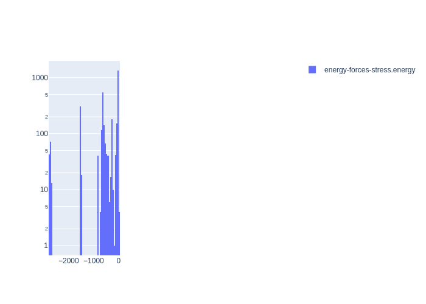

# Summary
|Chemical systems|Element ratios|# of properties|# of configurations|# of atoms|
|---|---|---|---|---|
|Ta|Ta (100.0%)|3196|3192|135956|

# Name

Ta_PINN_2021

# Authors

Yi-Shen Lin

Ganga P. Purja Pun

Yuri Mishin

# Links

https://arxiv.org/abs/2101.06540

# Description

A dataset consisting of the energies of supercells containing from 1 to 250 atoms. The supercells represent energy-volume relations for 8 crystal structures of Ta, 5 uniform deformation paths between pairs of structures, vacancies, interstitials, surfaces with low-index orientations, 4 symmetrical tilt grain boundaries, γ-surfaces on the (110) and (211) fault planes, a  [111] screw dislocation, liquid Ta, and several isolated clusters containing from 2 to 51 atoms. Some of the supercells contain static atomic configurations. However, most are snapshots of ab initio MD simulations at different densities, and temperatures ranging from 293 K to 3300 K. The BCC structure was sampled in the greatest detail, including a wide range of isotropic and uniaxial deformations.

# Storage format

|Elements|File|Format|Name field|
|---|---|---|---|
| Ta | 28396698008543566 | mongo | _name |

# Properties

|Property|KIM field|ASE field|Units
|---|---|---|---|
| [energy-forces-stress](/home/jvita/scripts/colabfit-tools/colabfit/examples/Ta_PINN_2021/energy-forces-stress.edn) | energy | energy | eV

# Property settings

|ID|Method|Description|Labels|Files|
|---|---|---|---|---|
| -354310195436804222 | VASP | energies/forces. All supercell energies (per atom) were shifted by a constant such that the DFT energy of the equilibrium BCC structure is equal to the negative experimental cohesive energy of BCC Ta. | PBE, GGA |  |

# Configuration sets

|ID|Description|# of structures| # of atoms|
|---|---|---|---|
| -9149385391704701136 | BCC structures with small homogeneous strains | 61 | 122 |
| -6446528381290347964 | A15 structures with isotropic strains at 0K | 39 | 312 |
| 2317803149729278572 | BCC structures with isotropic strains at 0K | 38 | 76 |
| -4224741777359401860 | beta-Ta structures with isotropic strains at 0K | 39 | 1170 |
| 1723564218680450137 | Diamond structures with isotropic strains at 0K | 68 | 544 |
| -3897335586388883661 | FCC structures with isotropic strains at 0K | 38 | 152 |
| -1887953251330929402 | HCP structures with isotropic strains at 0K | 37 | 148 |
| 3556918345543032980 | Simple hexagonal structures with isotropic strains at 0K | 38 | 76 |
| -7905052128720727127 | Simple cubic structures with isotropic strains at 0K | 38 | 38 |
| -3850804978961649379 | Dimer structures with isotropic strains at 0K | 12 | 24 |
| 5999514430971431995 | Linear trimer structures with isotropic strains at 0K | 12 | 36 |
| 7234833602731247209 | Triangular trimer structures with isotropic strains at 0K | 12 | 36 |
| 4575778141261657355 | Tetrahedron structures with isotropic strains at 0K | 12 | 48 |
| 1462519573644519281 | Samples along the twinning-antitwinning deformation path | 37 | 37 |
| 3808294679616401085 | Samples along the hexagonal deformation path from BCC to HCP | 121 | 484 |
| -1695962224340804171 | Samples along the orthorhombic deformation path from BCC to BCT | 101 | 404 |
| -1342233827232547937 | Samples along the tetragonal deformation path from BCC to FCC to BCT | 121 | 242 |
| 8508593080277221082 | Samples along the trigonal deformation path from BCC to SC to FCC | 471 | 471 |
| -2323900530286112224 | Samples of the gamma surface in the (110) plane | 54 | 1296 |
| 7472975420746810620 | Samples of the gamma surface in the (112) plane | 79 | 1896 |
| 3575382111698005621 | NVT-MD snapshots of liquid structures at various temperatures | 80 | 20000 |
| -4136485977642774420 | NVT-MD snapshots of BCC structures at various temperatures | 897 | 70638 |
| -7074948872687383887 | BCC structures with large uniaxial strain along the [100] direaction | 80 | 160 |
| -8966867251128453210 | BCC structures with large uniaxial strain along the [110] direaction | 80 | 320 |
| 4256059557630556115 | BCC structures with large uniaxial strain along the [111] direaction | 79 | 474 |
| 4032566407261524014 | NEB images from a dislocation relaxation run | 46 | 10626 |
| 27938466514683780 | Spherical clusters up to 2nd-/3rd-/4th- nearest-neighbor distances | 120 | 3720 |
| 5307482665765134235 | Sigma3 (111) grain boundary structures | 40 | 1920 |
| -6212353216466419196 | Sigma3 (112) grain boundary structures | 40 | 2880 |
| -5671605273219928571 | Sigma5 (210) grain boundary structures | 40 | 1440 |
| 5570975663253045914 | Sigma5 (310) grain boundary structures | 40 | 2400 |
| 4826149964205146131 | Vacancy configurations from NVT-MD and NEB calculations | 56 | 4152 |
| -4915811044208987216 | Interstitial configurations from NVT-MD and NEB calculations | 45 | 2845 |
| -326654375194124883 | Relaxed (100), (110), and (111) surface structures, plus NVT-MD samples at 2500K | 124 | 6776 |

# Configuration labels

|Labels|Counts|
|---|---|
| gamma_surface | 133 |
| bcc | 1235 |
| strain | 683 |
| eos | 383 |
| deformation_path | 849 |
| md | 1202 |
| nvt | 1202 |
| a15 | 39 |
| vacancy | 56 |
| cluster | 120 |
| grain_boundary | 160 |
| sigma5 | 80 |
| twinning | 37 |
| anti-twinning | 37 |
| interstitial | 45 |
| trimer | 24 |
| liquid | 80 |
| surface | 124 |
| tetrahedron | 12 |
| sc | 38 |
| dislocation | 46 |
| hcp | 37 |
| sigma3 | 80 |
| diamond | 68 |
| beta-ta | 39 |
| sh | 38 |
| fcc | 38 |
| dimer | 12 |

# Figures

