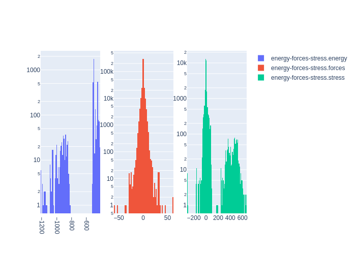

# Summary
|Chemical systems|Element ratios|# of properties|# of configurations|# of atoms|
|---|---|---|---|---|
|HfTiZr, HfTaTiZr|Hf (25.2%), Ti (25.2%), Zr (25.3%), Ta (24.3%)|3623|3622|223930|

# Name

TiZrHfTa_APS2021

# Authors

A. P. Thompson

L. P. Swiler

C. R. Trott

S. M. Foiles

G. J. Tucker

# Links

https://www.sciencedirect.com/science/article/pii/S0021999114008353

https://github.com/FitSNAP/FitSNAP/tree/master/examples/Ta_Linear_JCP2014

# Description

This data set was originally used to generate a linear SNAP potential for solid and liquid tantalum as published in Thompson, A.P. et. al, J. Comp. Phys. 285 (2015) 316-330.

# Storage format

|Elements|File|Format|Name field|
|---|---|---|---|
| Hf, Ti, Zr, Ta | 7241339560955000869 | mongo | _name |

# Properties

|Property|KIM field|ASE field|Units
|---|---|---|---|
| [energy-forces-stress](/home/jvita/scripts/colabfit-tools/colabfit/examples/TiZrHfTa_APS2021/energy-forces-stress.edn) | energy | energy | eV
| [energy-forces-stress](/home/jvita/scripts/colabfit-tools/colabfit/examples/TiZrHfTa_APS2021/energy-forces-stress.edn) | forces | forces | eV/Ang
| [energy-forces-stress](/home/jvita/scripts/colabfit-tools/colabfit/examples/TiZrHfTa_APS2021/energy-forces-stress.edn) | stress | stress | GPa

# Property settings

|ID|Method|Description|Labels|Files|
|---|---|---|---|---|
| 2231808486057270801 | VASP | energies/forces/stresses | GGA, PBE, LDA |  |

# Configuration sets

|ID|Description|# of structures| # of atoms|
|---|---|---|---|
| -8953864450878277109 | Configurations for the TiZrHfTa_x system with Ta concentrations between 0 and 33 percent generated via active learning. | 3622 | 223930 |

# Configuration labels

|Labels|Counts|
|---|---|
| active_learning | 3622 |

# Figures

