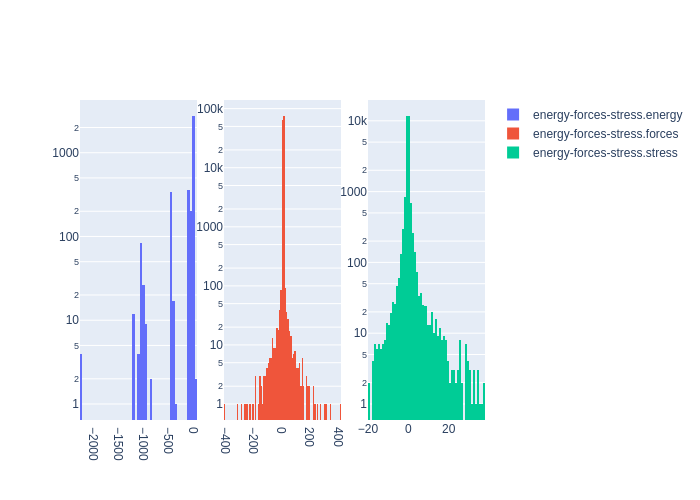

# Summary
|Chemical systems|Element ratios|# of properties|# of configurations|# of atoms|
|---|---|---|---|---|
|V|V (100.0%)|3802|3802|46466|

# Name

V_PRM2019

# Authors

J. Byggmästar

K. Nordlund

F. Djurabekova

# Links

https://journals.aps.org/prmaterials/abstract/10.1103/PhysRevMaterials.4.093802https://gitlab.com/acclab/gap-data/-/tree/master/V

# Description

This dataset was designed to ensure machine-learning of V elastic, thermal, and defect properties, as well as surface energetics, melting, and the structure of the liquid phase. The dataset was constructed by starting with the dataset from J. Byggmästar et al., Phys. Rev. B 100, 144105 (2019), then rescaling all of the configurations to the correct lattice spacing and adding in gamma surface configurations.

# Storage format

|Elements|File|Format|Name field|
|---|---|---|---|
| V | -3647727613107949158 | mongo | _name |

# Properties

|Property|KIM field|ASE field|Units
|---|---|---|---|
| [energy-forces-stress](/home/jvita/scripts/colabfit-tools/colabfit/examples/V_PRM2019/energy-forces-stress.edn) | energy | energy | eV
| [energy-forces-stress](/home/jvita/scripts/colabfit-tools/colabfit/examples/V_PRM2019/energy-forces-stress.edn) | forces | forces | eV/Ang
| [energy-forces-stress](/home/jvita/scripts/colabfit-tools/colabfit/examples/V_PRM2019/energy-forces-stress.edn) | stress | stress | GPa

# Property settings

|ID|Method|Description|Labels|Files|
|---|---|---|---|---|
| 2231808486057270801 | VASP | energies/forces/stresses | PBE, LDA, GGA |  |

# Configuration sets

|ID|Description|# of structures| # of atoms|
|---|---|---|---|
| 8701470853853923986 | Configurations designed to ensure machine-learning of elastic, thermal, and defect properties, as well as surface energetics, melting, and the structure of the liquid phase. | 3802 | 46466 |
| 6275295359701851991 | Liquid configurations with densities around the experimental density | 45 | 5760 |
| -3650961784449863937 | Configurations with single self-interstitial defects | 32 | 3872 |
| -9196755381899917153 | Single-vacancy configurations | 220 | 11660 |
| -3081163364782552407 | A15 configurations with random lattice distortions | 100 | 800 |
| 1789042212523536822 | BCC configurations with random strains up to +/- 30% to help train the far-from-equilibrium elastic response | 547 | 1094 |
| -6372201153152794045 | C15 configurations with random lattice distortions | 100 | 600 |
| 700716359174723621 | Configurations with two self-interstitial defects | 14 | 2228 |
| 4323599582754533142 | Divacancy configurations | 10 | 1180 |
| -812120933855860341 | Diamond configurations with random lattice distortions | 100 | 200 |
| -475288335578922667 | Dimers to fit to the full dissociation curve starting from 1.1 angstrom | 22 | 44 |
| -7462576851652836299 | FCC crystals with random lattice distortions | 100 | 100 |
| -7270302676653544207 | Configurations representing the full gamma surface | 178 | 2136 |
| 6370992486468407726 | HCP configurations with random lattice distortions | 100 | 200 |
| -3061357766573780947 | Isolated W atom | 1 | 1 |
| 3401642299953948493 | MD snapshots taken at 1000K for three different volumes | 50 | 2700 |
| -8149774167301130169 | Simple cubic crystals with random lattice distortions | 100 | 100 |
| 6247418440158372931 | BCC crystals with random interstitial atom defects to capture short-range many-body dynamics | 90 | 4860 |
| 7387640848788998880 | Randomly distorted primitive bcc unit cells drawn from Szlachta et al.'s database | 1776 | 1776 |
| -7785336843759381935 | Damaged and half-molten (110) and (100) surfaces | 24 | 3264 |
| 6967106855242730533 | Configurations with single self-interstitial defects | 45 | 540 |
| -4437177377023831415 | (110) surface configurations | 45 | 540 |
| -3844162237985293646 | (111) surface configurations | 43 | 516 |
| 3360152541385397443 | (112) surface configurations | 45 | 540 |
| 6993846717343801309 | Trivacancy configurations | 15 | 1755 |

# Configuration labels

|Labels|Counts|
|---|---|
| bcc | 2413 |
| strain | 2823 |
| liquid | 69 |
| surface | 380 |
| vacancy | 245 |
| c15 | 100 |
| interstitial | 136 |
| warning | 112 |
| large_forces | 112 |
| repulsive | 112 |
| hcp | 100 |
| gamma_surface | 178 |
| fcc | 100 |
| sc | 100 |
| diamond | 115 |
| aimd | 50 |
| dimer | 22 |
| a15 | 100 |
| sh | 10 |
| divacancy | 25 |
| trivacancy | 15 |
| isolated_atom | 1 |

# Figures

