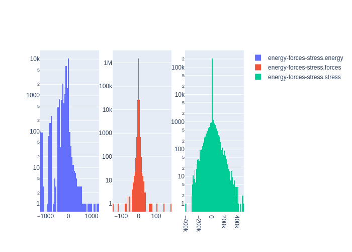

# Summary
|Chemical systems|Element ratios|# of properties|# of configurations|# of atoms|
|---|---|---|---|---|
|BeW, W, Be|Be (50.2%), W (49.8%)|25120|25055|524332|

# Name

WBe_PRB2019

# Authors

M. A. Wood

M. A. Cusentino

B. D. Wirth

A. P. Thompson

# Links

https://journals.aps.org/prb/abstract/10.1103/PhysRevB.99.184305

https://github.com/FitSNAP/FitSNAP/tree/master/examples/WBe_PRB2019

# Description

This data set was originally used to generate a multi-component linear SNAP potential for tungsten and beryllium as published in Wood, M. A., et. al. Phys. Rev. B 99 (2019) 184305. This data set was developed for the purpose of studying plasma material interactions in fusion reactors.

# Storage format

|Elements|File|Format|Name field|
|---|---|---|---|
| Be, W | 352370728548290465 | mongo | _name |

# Properties

|Property|KIM field|ASE field|Units
|---|---|---|---|
| [energy-forces-stress](/home/jvita/scripts/colabfit-tools/colabfit/examples/WBe_PRB2019/energy-forces-stress.edn) | energy | energy | eV
| [energy-forces-stress](/home/jvita/scripts/colabfit-tools/colabfit/examples/WBe_PRB2019/energy-forces-stress.edn) | forces | forces | eV/Ang
| [energy-forces-stress](/home/jvita/scripts/colabfit-tools/colabfit/examples/WBe_PRB2019/energy-forces-stress.edn) | stress | stress | GPa

# Property settings

|ID|Method|Description|Labels|Files|
|---|---|---|---|---|
| 2231808486057270801 | VASP | energies/forces/stresses | PBE, LDA, GGA |  |

# Configuration sets

|ID|Description|# of structures| # of atoms|
|---|---|---|---|
| -447737915248557092 | W-Be configurations for studying plasma material interactions in fusion reactors | 25055 | 524332 |
| 4752835303342329042 | Be [001], [010], and [100] surfaces | 90 | 5760 |
| -5334679418531835066 | AIMD sampling of Be at 1000K | 505 | 24240 |
| -3327764050489686714 | AIMD sampling of Be at 300K | 404 | 19392 |
| 8393387460153298965 | AIMD sampling of W-Be at 1000K | 1562 | 76290 |
| -1407039098311253929 | AIMD sampling of W-Be at 300K | 1798 | 89418 |
| -198270691962509086 | divacancy defects in pure W | 38 | 1976 |
| -6751131874800363350 | Energy vs. volume EOS configurations for W-Be | 1638 | 12803 |
| -5471241796116270190 | Energy vs. volume EOS configurations for Be in various crystal structures | 400 | 1400 |
| 7658100375443612579 | Energy vs. volume configurations for W | 125 | 1156 |
| -1659281819136912806 | BCC, FCC, and HCP Be with shear or volumetric strains | 4594 | 14420 |
| 3206676051047441025 | W-Be in various crystal structures with shear and volumetric strains | 4316 | 22680 |
| -8401334465959240143 | Liquid Be | 75 | 19200 |
| -697003027643240625 | Be stacking faults | 5 | 240 |
| 1098999107524928634 | Be adhesion onto W surfaces | 368 | 36233 |
| -8349553072373839392 | W dislocation quadrupole configurations | 98 | 13230 |
| -6724246170214885108 | W gamma surface configurations | 6183 | 74196 |
| -3015673267652875245 | W gamma surface configurations | 750 | 35250 |
| -2006195710322429354 | AIMD sampling of bulk W | 60 | 7680 |
| 8853695922566532184 | pure W surfaces | 180 | 2160 |
| 2836677760913630337 | bulk W with vacancy defects | 420 | 23740 |

# Configuration labels

|Labels|Counts|
|---|---|
| aimd | 4323 |
| bcc | 2129 |
| elastic | 8910 |
| surface | 7203 |
| gamma_surface | 6933 |
| eos | 1638 |
| liquid | 75 |
| dislocation | 98 |
| divacancy | 38 |
| stacking_fault | 5 |

# Figures

