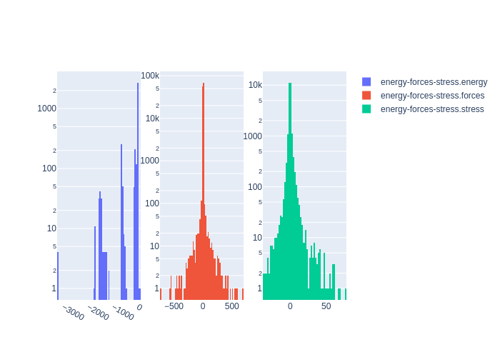

# Summary
|Chemical systems|Element ratios|# of properties|# of configurations|# of atoms|
|---|---|---|---|---|
|W|W (100.0%)|3528|3528|42068|

# Name

W_PRB2019

# Authors

J. Byggmästar

A. Hamedani

K. Nordlund

F. Djurabekova

# Links

https://journals.aps.org/prb/abstract/10.1103/PhysRevB.100.144105

https://gitlab.com/acclab/gap-data/-/tree/master/W/2019-05-24

# Description

This dataset was originally designed to fit a GAP potential with a specific focus on properties relevant for simulations of radiation-induced collision cascades and the damage they produce, including a realistic repulsive potential for the short-range many-body cascade dynamics and a good description of the liquid phase.

# Storage format

|Elements|File|Format|Name field|
|---|---|---|---|
| W | -4771874696486533827 | mongo | _name |

# Properties

|Property|KIM field|ASE field|Units
|---|---|---|---|
| [energy-forces-stress](/home/jvita/scripts/colabfit-tools/colabfit/examples/W_PRB2019/energy-forces-stress.edn) | energy | energy | eV
| [energy-forces-stress](/home/jvita/scripts/colabfit-tools/colabfit/examples/W_PRB2019/energy-forces-stress.edn) | forces | forces | eV/Ang

# Property settings

|ID|Method|Description|Labels|Files|
|---|---|---|---|---|
| 2231808486057270801 | VASP | energies/forces/stresses | LDA, PBE, GGA |  |

# Configuration sets

|ID|Description|# of structures| # of atoms|
|---|---|---|---|
| 8056910056927105588 | Configurations with a specific focus on properties relevant for simulations of radiation-induced collision cascades and the damage they produce, including a realistic repulsive potential for the short-range many-body cascade dynamics and a good description of the liquid phase | 3528 | 42068 |
| 4626087531151486693 | Simple cubic crystals with random lattice distortions | 100 | 100 |
| -8321444304607147063 | Liquid W with densities around the experimental density of 17.6 g/cm^3 | 45 | 5760 |
| -7496570381034871111 | BCC crystals with random interstitial atom defects to capture short-range many-body dynamics | 100 | 5390 |
| 7868974388036813401 | Single-vacancy configurations | 201 | 10653 |
| -8506880005264549940 | Divacancy configurations | 10 | 1180 |
| 6204105573184383306 | MD snapshots taken at 1000K for three different volumes | 20 | 1080 |
| -3119023104386640900 | Randomly distorted primitive bcc unit cells drawn from Szlachta et al.'s database | 1776 | 1776 |
| -1313316394473951909 | FCC crystals with random lattice distortions | 100 | 100 |
| 6824261793960417252 | BCC configurations with random strains up to +/- 30% to help train the far-from-equilibrium elastic response | 500 | 1000 |
| 3203970826637568154 | Dimers to fit to the full dissociation curve starting from 1.1 angstrom | 13 | 26 |
| -856932497904727043 | (111) surface configurations | 43 | 516 |
| 1308672917333943814 | C15 configurations with random lattice distortions | 100 | 600 |
| 8257318931503525199 | Diamond configurations with random lattice distortions | 100 | 200 |
| -1150972068441141681 | HCP configurations with random lattice distortions | 100 | 200 |
| 2122207293298157812 | Damaged and half-molten (110) and (100) surfaces | 24 | 3264 |
| -2947235056888917109 | Configurations with single self-interstitial defects | 45 | 540 |
| 7026587515440432545 | Configurations with single self-interstitial defects | 32 | 3872 |
| -255619561952829353 | (112) surface configurations | 45 | 540 |
| 4661379161821662500 | (110) surface configurations | 45 | 540 |
| 2801675261871289727 | Trivacancy configurations | 15 | 1755 |
| 4036892164432280629 | A15 configurations with random lattice distortions | 100 | 800 |
| -5131117078150009868 | Isolated W atom | 1 | 1 |
| -7371107788981922434 | Configurations with two self-interstitial defects | 14 | 2228 |

# Configuration labels

|Labels|Counts|
|---|---|
| bcc | 2376 |
| strain | 2776 |
| hcp | 100 |
| diamond | 111 |
| fcc | 100 |
| surface | 202 |
| interstitial | 146 |
| warning | 113 |
| large_forces | 113 |
| repulsive | 113 |
| a15 | 100 |
| vacancy | 226 |
| c15 | 100 |
| liquid | 47 |
| sc | 100 |
| sh | 10 |
| divacancy | 25 |
| trivacancy | 15 |
| aimd | 20 |
| dimer | 13 |
| isolated_atom | 1 |

# Figures

