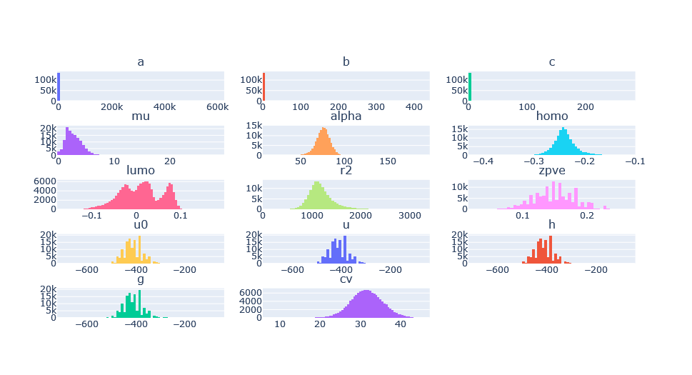

===========
QM9 example
===========

This example will be used to highlight some of the more advanced features of the
Dataset class using the popular `QM9 dataset <https://figshare.com/collections/Quantum_chemistry_structures_and_properties_of_134_kilo_molecules/978904>`_.
It is suggested that you go through the :ref:`basic example <Basic example>` first. The complete
code will not be shown in this example (for the complete code, see the Jupyter
notebook at :code:`colabfit/examples/qm9.ipynb`); instead, only the additional features will be
discussed here.

Note that this example assumes that the raw data has already been downloaded
using the following commands:

.. code-block:: console

    $ mkdir qm9
    $ cd qm9 && wget -O dsgdb9nsd.xyz.tar.bz2 https://figshare.com/ndownloader/files/3195389 && tar -xvjf dsgdb9nsd.xyz.tar.bz2

Writing a custom property for QM9
=================================

The QM9 dataset contains a large number of computed properties for each
Configuration, as documented in `its original README <https://figshare.com/articles/dataset/Readme_file_Data_description_for_Quantum_chemistry_structures_and_properties_of_134_kilo_molecules_/1057641?backTo=/collections/Quantum_chemistry_structures_and_properties_of_134_kilo_molecules/978904>`_. 

In order to preserve this information, a custom property can be defined
(see :ref:`Custom properties` for more information).

.. code-block:: python

    qm9_property_definition = {
        'property-id': 'qm9-property',
        'property-title': 'A, B, C, mu, alpha, homo, lumo, gap, r2, zpve, U0, U, H, G, Cv',
        'property-description': 'Geometries minimal in energy, corresponding harmonic frequencies, dipole moments, polarizabilities, along with energies, enthalpies, and free energies of atomization',
        'a':     {'type': 'float', 'has-unit': True, 'extent': [], 'required': True, 'description': 'Rotational constant A'},
        'b':     {'type': 'float', 'has-unit': True, 'extent': [], 'required': True, 'description': 'Rotational constant B'},
        'c':     {'type': 'float', 'has-unit': True, 'extent': [], 'required': True, 'description': 'Rotational constant C'},
        'mu':    {'type': 'float', 'has-unit': True, 'extent': [], 'required': True, 'description': 'Dipole moment'},
        'alpha': {'type': 'float', 'has-unit': True, 'extent': [], 'required': True, 'description': 'Isotropic polarizability'},
        'homo':  {'type': 'float', 'has-unit': True, 'extent': [], 'required': True, 'description': 'Energy of Highest occupied molecular orbital (HOMO)'},
        'lumo':  {'type': 'float', 'has-unit': True, 'extent': [], 'required': True, 'description': 'Energy of Lowest occupied molecular orbital (LUMO)'},
        'gap':   {'type': 'float', 'has-unit': True, 'extent': [], 'required': True, 'description': 'Gap, difference between LUMO and HOMO'},
        'r2':    {'type': 'float', 'has-unit': True, 'extent': [], 'required': True, 'description': 'Electronic spatial extent'},
        'zpve':  {'type': 'float', 'has-unit': True, 'extent': [], 'required': True, 'description': 'Zero point vibrational energy'},
        'u0':    {'type': 'float', 'has-unit': True, 'extent': [], 'required': True, 'description': 'Internal energy at 0 K'},
        'u':     {'type': 'float', 'has-unit': True, 'extent': [], 'required': True, 'description': 'Internal energy at 298.15 K'},
        'h':     {'type': 'float', 'has-unit': True, 'extent': [], 'required': True, 'description': 'Enthalpy at 298.15 K'},
        'g':     {'type': 'float', 'has-unit': True, 'extent': [], 'required': True, 'description': 'Free energy at 298.15 K'},
        'cv':    {'type': 'float', 'has-unit': True, 'extent': [], 'required': True, 'description': 'Heat capacity at 298.15 K'},
        'smiles-relaxed':    {'type': 'string', 'has-unit': False, 'extent': [], 'required': True, 'description': 'SMILES for relaxed geometry'},
        'inchi-relaxed':     {'type': 'string', 'has-unit': False, 'extent': [], 'required': True, 'description': 'InChI for relaxed geometry'},
    }

.. code-block:: python

    dataset.custom_definitions = {'qm9-property': qm9_property_definition}

Note that a property definition is used for performing verification checks when
parsing the data. A :attr:`property_map` must still be provided for specifying
_how_ to parse the data and what the units of the fields are.

.. code-block:: python

    property_map = {
        'qm9-property': {
            # Property Definition field: {'field': ASE field, 'units': ASE-readable units}
            'a':     {'field': 'A',     'units': 'GHz'},
            'b':     {'field': 'B',     'units': 'GHz'},
            'c':     {'field': 'C',     'units': 'GHz'},
            'mu':    {'field': 'mu',    'units': 'Debye'},
            'alpha': {'field': 'alpha', 'units': 'Bohr*Bohr*Bohr'},
            'homo':  {'field': 'homo',  'units': 'Hartree'},
            'lumo':  {'field': 'lumo',  'units': 'Hartree'},
            'gap':   {'field': 'gap',   'units': 'Hartree'},
            'r2':    {'field': 'r2',    'units': 'Bohr*Bohr'},
            'zpve':  {'field': 'zpve',  'units': 'Hartree'},
            'u0':    {'field': 'U0',    'units': 'Hartree'},
            'u':     {'field': 'U',     'units': 'Hartree'},
            'h':     {'field': 'H',     'units': 'Hartree'},
            'g':     {'field': 'G',     'units': 'Hartree'},
            'cv':    {'field': 'Cv',    'units': 'cal/mol/K'},
            'smiles-relaxed': {'field': 'SMILES_relaxed', 'units': None},
            'inchi-relaxed': {'field': 'SMILES_relaxed',  'units': None},
        }
    }

.. code-block:: python

    dataset.property_map = property_map

Defining a reader function
==========================

Since the data in QM9 is not stored in a typical format (it uses an uncommon
modification to the typical XYZ format), it is necessary to use the
:class:`~colabfit.tools.converters.FolderConverter` class, with a custom
:meth:`~colabfit.tools.converters.FolderConverter.reader` function.

.. code-block:: python

    def reader(file_path):
        # A function for returning a list of ASE a

        properties_order = [
            'tag', 'index', 'A', 'B', 'C', 'mu', 'alpha', 'homo', 'lumo', 'gap', 'r2', 'zpve', 'U0', 'U', 'H', 'G', 'Cv'
        ]

        images = []
        with open(file_path, 'r') as f:
            lines = [_.strip() for _ in f.readlines()]

            na = int(lines[0])
            properties = lines[1].split()

            symbols = []
            positions = []
            partial_charges = []

            for line in lines[2:2+na]:
                split = line.split()
                split = [_.replace('*^', 'e') for _ in split]  # Python-readable scientific notation

                # Line order: symbol, x, y, z, charge
                symbols.append(split[0])
                positions.append(split[1:4])
                partial_charges.append(split[-1])

            positions = np.array(positions)
            partial_charges = np.array(partial_charges, dtype=float)

            atoms = Atoms(symbols=symbols, positions=positions)

            atoms.info['mulliken_partial_charges'] = partial_charges

            name = os.path.splitext(os.path.split(file_path)[-1])[0]

            atoms.info['name'] = name

            for pname, val in zip(properties_order[2:], properties[2:]):
                atoms.info[pname] = float(val)

            frequencies = np.array(lines[-3].split(), dtype=float)
            atoms.info['frequencies'] = frequencies

            smiles = lines[-2].split()
            inchi  = lines[-1].split()

            atoms.info['SMILES']    = smiles[0]
            atoms.info['SMILES_relaxed'] = smiles[1]
            atoms.info['InChI']     = inchi[0]
            atoms.info['InChI_relaxed']  = inchi[1]

            images.append(atoms)

        return images

.. code-block:: python

    dataset.configurations = load_data(
        file_path='qm9',
        file_format='folder',
        name_field='name',  # key in Configuration.info to use as the Configuration name
        elements=['H', 'C', 'N', 'O', 'F'],    # order matters for CFG files, but not others
        default_name='qm9',  # default name with `name_field` not found
        reader=reader,
        glob_string='*.xyz',
        verbose=True
    )

Writing to Markdown
===================

To avoid having to re-process the raw data using :code:`reader`, and to provide
a cleaner storage format, :meth:`~colabfit.tools.dataset.Dataset.to_markdown`
can be used (see :ref:`Reading/writing Datasets with Markdown` for more
details).

.. code-block:: python

    dataset.to_markdown(
        base_folder='/content',
        html_file_name='README.md',
        data_file_name=dataset.name+'.extxyz',
        data_format='xyz',
    )

Cleaning the dataset
====================

Using the :meth:`~colabfit.tools.dataset.Dataset.plot_histograms` and
:meth:`~colabfit.tools.dataset.Dataset.get_statistics` functions reveals that
the QM9 dataset has some outlying data entries.

.. code-block:: python

    print(dataset.get_statistics('a'))
    print(dataset.get_statistics('b'))
    print(dataset.get_statistics('c'))

    # {'average': 9.814382088508797, 'std': 1809.4589082320583, 'min': 0.0, 'max': 619867.68314, 'average_abs': 9.814382088508797}
    # {'average': 1.4060972645920002, 'std': 1.5837889998648804, 'min': 0.33712, 'max': 437.90386, 'average_abs': 1.4060972645920002}
    # {'average': 1.1249210272988013, 'std': 1.0956136904779634, 'min': 0.33118, 'max': 282.94545, 'average_abs': 1.1249210272988013}

.. code-block:: python
    
    dataset.plot_histograms([
        'a', 'b', 'c', 'mu', 'alpha', 'homo', 'lumo', 'r2', 'zpve', 'u0', 'u',
        'h', 'g', 'cv'
    ])

The :meth:`~colabfit.tools.dataset.Dataset.filter` function can be used to
return a new dataset without the outlying data.

.. code-block:: python

    clean = dataset.filter(
        'data',
        lambda p: (p['a']['source-value'] < 20) and (p['b']['source-value'] < 10),
        verbose=True
    )

.. code-block:: python

    clean.plot_histograms([
        'a', 'b', 'c', 'mu', 'alpha', 'homo', 'lumo', 'r2', 'zpve', 'u0', 'u',
        'h', 'g', 'cv'
    ])

.. code-block:: python

    print(clean.get_statistics('a'))
    print(clean.get_statistics('b'))
    print(clean.get_statistics('c'))

    # {'average': 3.407053427070018, 'std': 1.3368223663235594, 'min': 0.0, 'max': 19.99697, 'average_abs': 3.407053427070018}
    # {'average': 1.3966863945821093, 'std': 0.45813797072575396, 'min': 0.33712, 'max': 9.93509, 'average_abs': 1.3966863945821093}
    # {'average': 1.1177706236464617, 'std': 0.328798457356026, 'min': 0.33118, 'max': 6.46247, 'average_abs': 1.1177706236464617}

.. image:: qm9_clean_histograms.png
    :align: center

